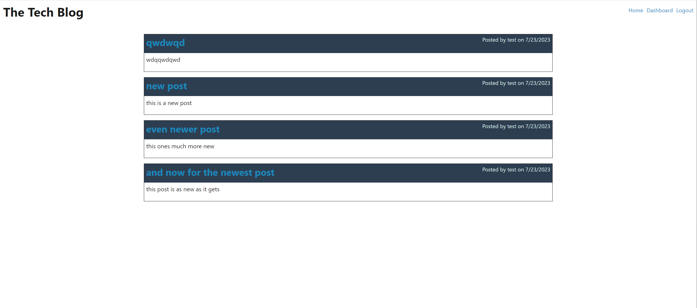
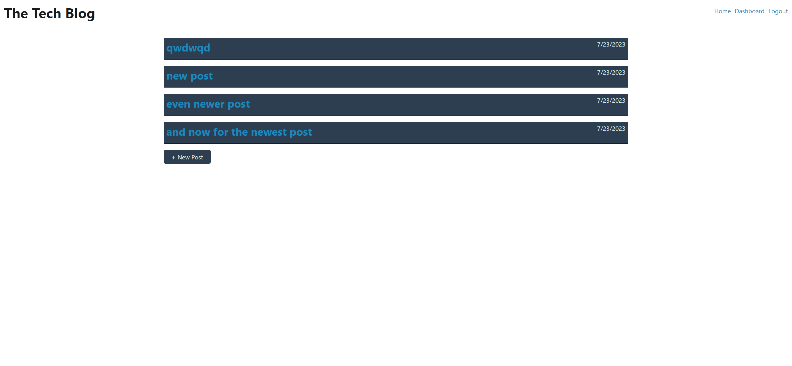
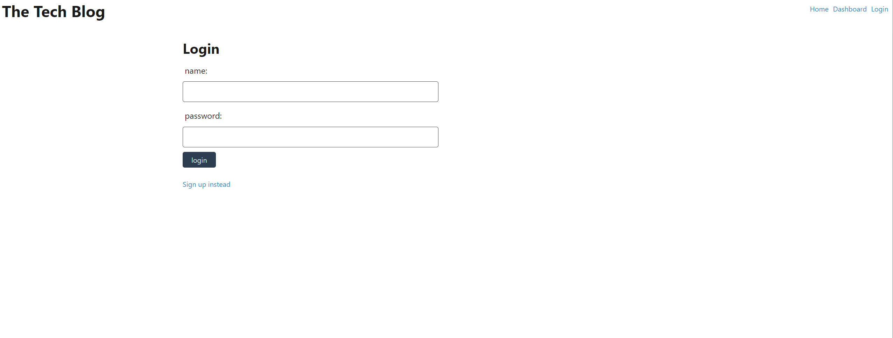

# MVC Tech Blog Assignment

## Table of Contents
* [Description](#description)
* [Built-With](#built-with)
* [Demo](#demo)
* [Installation](#installation)
* [Questions](#questions)

## Description

This is a dynamic application that publishes a user's blogposts. It uses Handlebars.js as the templating language, Sequelize as the ORM, where a user's info, posts and comments are stored, and express-session npm package for authentication.

## Built-With

  
  
  
  
  
  
  
  
  

## Demo

The following images display the web application's appearance and functionality:

## Installation

There is no installation required for this website. The webpage can be found by clicking the link below:

[Tech-Blog-Heroku](https://caros-tech-blog-5b902c01d0b5.herokuapp.com/)

## Questions

If there are additional questions, please reach out to me here:

* GitHub: https://github.com/Seropyan1995
* Email: seropyangevork@rocketmail.com
